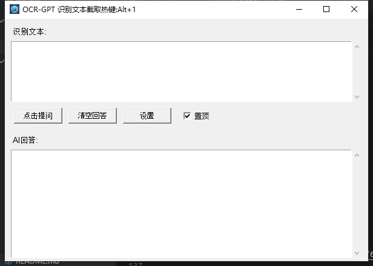

# OCR-GPT

一个基于 GPT 的桌面文本助手，支持截图 OCR 识别和智能问答。

## 🌟 功能特点

- 📸 **快捷键截图识别** - 按 Alt+1 快速截图识别文本
- 🤖 **GPT 智能问答** - 集成 GPT API，提供智能对话功能
- ✏️ **文本编辑** - 支持文本编辑和自定义提问
- 🎯 **界面简洁** - 操作便捷，用户体验友好
- ⚙️ **自定义配置** - 支持自定义 API 配置
- 📌 **窗口置顶** - 支持窗口置顶设置
- ⚡ **快捷操作** - 支持回车快捷提问
- 💾 **绿色便携** - 配置文件保存在程序同目录，便于携带

## 🚀 快速开始

### 下载使用

1. 从 [Releases](../../releases) 下载最新版本的 `OCR-GPT.exe`
2. 双击运行程序
3. 首次使用需要在"设置"中配置 API 密钥
4. 按 `Alt+1` 开始截图识别文本

### 基本操作

1. **截图识别**: 按 `Alt+1` 可以截图识别文本
2. **文本编辑**: 直接在文本框中编辑或输入问题
3. **智能问答**: 按回车或点击"提问"按钮获取 AI 回答
4. **设置配置**: 点击"设置"按钮配置 API
5. **窗口置顶**: 点击"置顶"让窗口保持在最上层

## 🔧 API 配置

### 🔍 百度 OCR（可选）

1. 访问 [百度 AI 开放平台](https://ai.baidu.com)
2. 注册账号并创建应用
3. 选择"文字识别"服务
4. 获取 `API Key` 和 `Secret Key`

### 🤖 GPT API（必需）

1. 访问 [API 服务](https://free.v36.cm)
2. 注册账号获取 API Key
3. 默认 API 地址：`https://free.v36.cm/v1/chat/completions`

> 📝 **注意**: 程序支持各种兼容 OpenAI API 格式的服务

## 🛠️ 开发环境

### 系统要求

- **Python**: 3.8+
- **操作系统**: Windows 10/11
- **内存**: 至少 2GB

### 依赖包

```txt
requests==2.31.0
pyautogui==0.9.54
keyboard==0.13.5
Pillow==10.0.0
```

### 安装与运行

```bash
# 克隆仓库
git clone https://github.com/your-username/ocr-gpt.git
cd ocr-gpt

# 安装依赖
pip install -r requirements.txt

# 运行程序
python text_search.py
```

### 打包为 EXE

```bash
# 使用构建脚本
python build.py

# 或者使用批处理文件
build.bat
```

打包后的 `OCR-GPT.exe` 文件将在 `dist/` 目录中。

## 📝 技术架构

- **界面框架**: 原生 tkinter
- **截图功能**: pyautogui
- **全局热键**: keyboard
- **图像处理**: Pillow
- **网络请求**: requests
- **配置管理**: 自定义 JSON 配置

## 💾 配置文件

程序会在以下位置创建 `config.json` 文件：

- **开发环境**: 脚本同目录
- **打包环境**: EXE 文件同目录

这保证了程序的绿色便携性，可以随意移动和备份。

## 📄 项目结构

```
ocr-gpt/
├── text_search.py      # 主程序文件
├── config_manager.py   # 配置管理模块
├── build.py           # 构建脚本
├── requirements.txt    # 依赖清单
├── ai.png             # 主图标 (PNG 格式)
├── ai.ico             # 图标 (ICO 格式)
├── version_info.txt    # 版本信息
└── hooks/             # PyInstaller 钩子
    └── rthook.py      # 运行时钩子
```

## 🚀 特性亮点

- ✨ **绿色便携**: 不需安装，下载即用
- 💾 **配置统一**: 配置文件与程序在同一目录
- 🎯 **操作简单**: 一键截图，直接问答
- 🔄 **多线程**: UI 响应流畅，不卡顿
- 💻 **跨平台**: 支持 Windows 10/11

## 📷 截图示例



*OCR-GPT 主界面界面展示 - 支持截图识别、智能问答、窗口置顶等功能*

## 🔍 故障排除

### 常见问题

**Q: 程序无法启动？**
A: 请检查是否被杀毒软件误报，将程序添加到信任列表。

**Q: 截图功能不工作？**
A: 请确保程序以管理员权限运行，并检查防火墙设置。

**Q: API 调用失败？**
A: 请检查网络连接和 API 密钥配置是否正确。

**Q: 界面显示乱码？**
A: 请确保系统安装了中文字体，或更新到最新版 Windows。

## 📝 更新日志

### v1.0.0 (2024-09-03)

- ✨ 初始发布
- 📸 支持截图 OCR 识别
- 🤖 集成 GPT 智能问答
- ⚙️ 支持自定义 API 配置
- 💾 绿色便携化配置管理
- 🎨 自定义图标设计

## 🤝 贡献

欢迎提交 Issue 和 Pull Request！

1. Fork 本仓库
2. 创建特性分支 (`git checkout -b feature/AmazingFeature`)
3. 提交更改 (`git commit -m 'Add some AmazingFeature'`)
4. 推送到分支 (`git push origin feature/AmazingFeature`)
5. 开启 Pull Request

## 📄 许可证

MIT License
